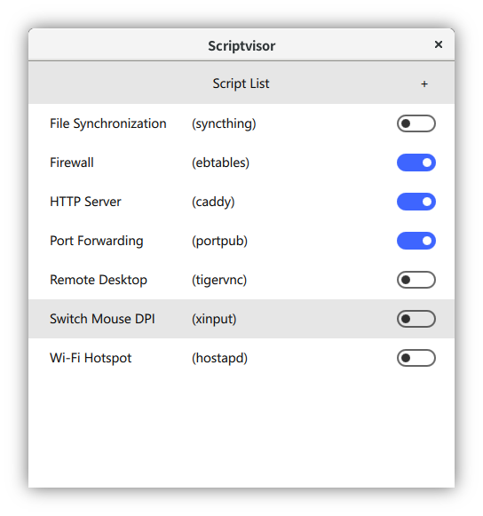
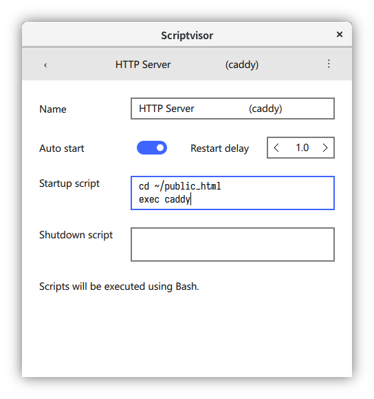

Scriptvisor
===========

Simple supervisor utility to allow you start & stop preconfigured scripts in one click

## Building

You will need at least [Qt](https://www.qt.io/) 5.8 to build it

- To build using an IDE:

  1. Open [Qt Creator](https://www.qt.io/ide/)

  2. Open `Scriptvisor.qbs`

  3. Click Build → Build Project "Scriptvisor"

- To build using [Qbs](http://doc.qt.io/qbs/)

  1. Type `qbs setup-qt --detect`

     A list of profile names will be shown on the screen, copy the one you need, for example, `qt-5-8-0`

  2. Type `qbs setup-toolchains --detect`

  3. Type `qbs config defaultProfile qt-5-8-0`, where `qt-5-8-0` is the profile name you just copied

  4. Type `mkdir -p build`

  5. Type `qbs build -d build`

  To simplify your build process, you can type `make`, which will execute `Makefile` and do the work for you.

## Scripting

On Windows, scripts are executed using PowerShell; on POSIX systems, scripts are executed using Bash.

### Startup script

If your startup script returns an exit code of non-zero, and restart delay is set to non-zero, your startup script will be executed again after the delay.

If your startup script returns an exit code of non-zero, but restart delay is set to zero, your script will be shown as "not running" in the menu.

If your startup script does not exit, or returns an exit code of zero, your script will be shown as "running" in the menu.

### Shutdown script

When your startup script is shown as "running", you can click on the switch to stop the script.

The shutdown script will be first executed, then processes started with startup script will be killed.

All shutdown scripts need to be executed before Scriptvisor exits. You may choose "Force Quit" in the tray icon menu if it takes too long.

## License

Scriptvisor is licensed under BSD-3-Clause, see [LICENSE](LICENSE) for more details.

You may embed Scriptvisor into your toolbox and release it as you like. But remember to leave a link to this original project, so users can update Scriptvisor when new versions release.
